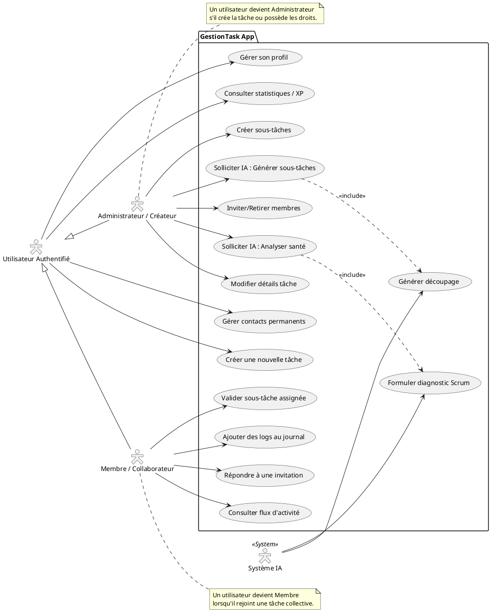
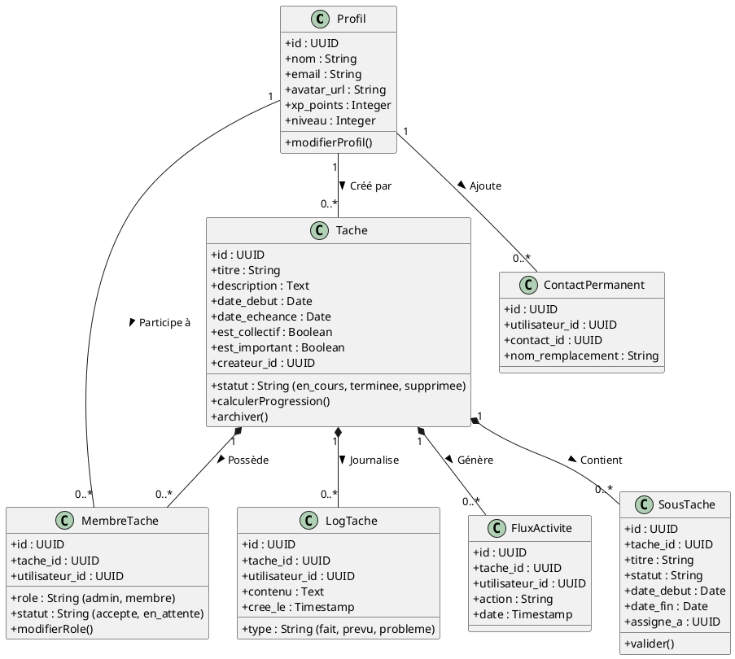
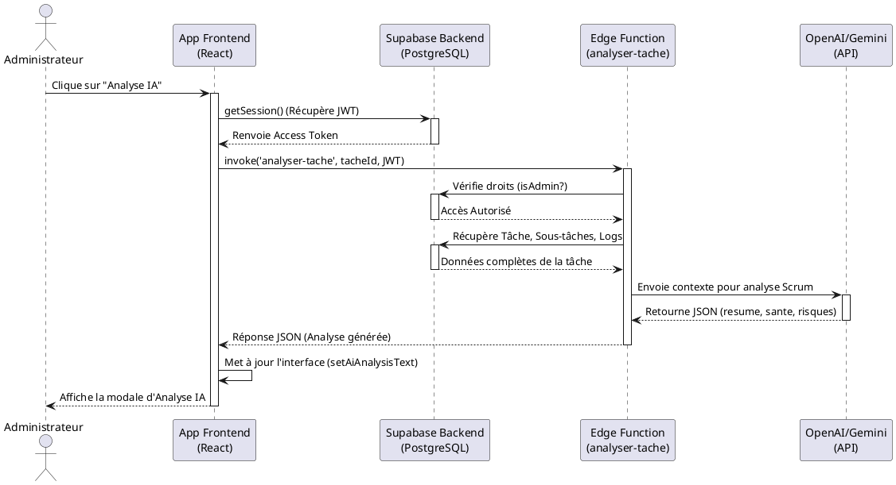

# Diagrammes UML pour GestionTask

Voici le code PlantUML pour vos trois diagrammes. Vous pouvez copier-coller ces blocs directement sur [PlantText.com](https://www.planttext.com/) ou [PlantUML Web Server](https://plantuml.com/plantuml/) pour générer les images.

## 1. Diagramme des Cas d'Utilisation (Use Case Diagram)

## 2. Diagramme de Classes (Class Diagram)

## 3. Diagramme de Séquence (Sequence Diagram) - Analyse IA

Ce diagramme illustre le flux lorsqu'un Administrateur clique sur "Analyse IA".

